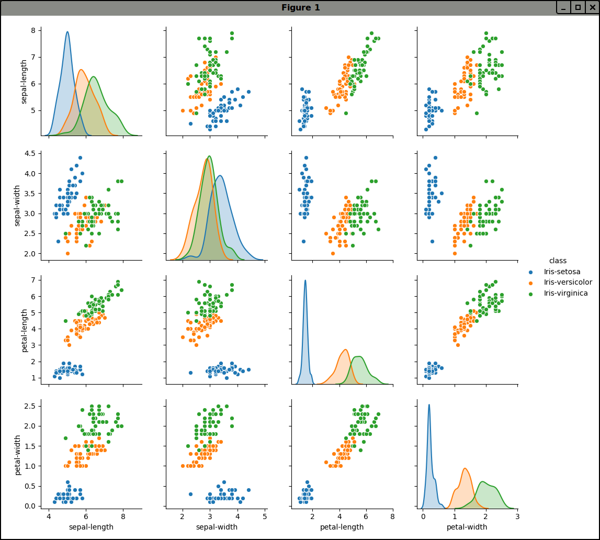

# Machine Learning with SciPy

[](http://snyk.io/test/github/mramshaw/ML_with_SciPy?style=plastic&targetFile=requirements.txt)

A quick end-to-end exploration of a simple Machine Learning project.

## Motivation

While I had previously investigated
[Machine Learning](http://github.com/mramshaw/Intro-to-ML)
and [Data Cleaning](http://github.com/mramshaw/Data-Cleaning),
the opportunity to follow along and experience an ML project
from end to end seemed like a great way to gain perspective
on what actually happens in a simple project.

The sequence of events is as follows:

1. Install Python and the SciPy platform
2. Load the Iris dataset
3. Summarize the dataset
4. Visualize the dataset
5. Evaluate some algorithms
6. Make some predictions

I had previously done most of these things - with the exception of
__5__ (evaluating different algorithms), which was thus of particular interest.

## Table of Contents

The contents are as follows:

* [Prerequisites](#prerequisites)
* [Data](#data)
* [Data Summarized](#data-summarized)
* [Data Visualized](#data-visualized)
    * [Univariate plots](#univariate-plots)
    * [Multivariate plots](#multivariate-plots)
* [Evaluate Algorithms](#evaluate-algorithms)
* [Make Predictions](#make-predictions)
* [Versions](#versions)
* [Concepts](#concepts)
    * [Box-and-whisker plots](#box-and-whisker-plots)
* [Seaborn](#seaborn)
* [Reference](#reference)
* [To Do](#to-do)
* [Credits](#credits)

## Prerequisites

Either __Python 2__ or __Python 3__ is required, as well as
a copy of `pip` (either `pip` for Python 2 or `pip3` for
Python 3).

Install the required libraries as follows:

    $ pip install --user -r requirements.txt

[I never recommend Global installation. Replace with `pip3` for Python 3.]

Find the installed versions by running <kbd>python versions.py</kbd> as shown:

```bash
$ python versions.py
Python: 2.7.12 (default, Nov 12 2018, 14:36:49) 
[GCC 5.4.0 20160609]
scipy: 0.17.0
numpy: 1.14.0
matplotlib: 2.0.2
pandas: 0.20.3
sklearn: 0.20.0
seaborn: 0.9.0
$
```

## Data

We will use the well-known
[Iris data set](http://en.wikipedia.org/wiki/Iris_flower_data_set),
which I previously used in my
[Iris](http://github.com/mramshaw/Intro-to-ML/tree/master/Iris) exercise.

[There we accessed the data set via sklearn's `load_iris` convenience method.]

This data set should be available at:

    http://archive.ics.uci.edu/ml/datasets/Iris

My experience has been that data sets, as well as software libraries, tend
to experience ___drift___ over time. Accordingly, in order to try to replicate
the published results as closely as possible, I downloaded the data set from
the [author's published version](http://raw.githubusercontent.com/jbrownlee/Datasets/master/iris.csv).

As this is a well-known data set, we will not need to do any data cleaning
(which would generally be a considerable time-sink in any ML exercise).

## Data Summarized

The __summarization__ part of the output should look as follows:

```bash
$ python iris.py
Rows, columns = (150, 5)

    sepal-length  sepal-width  petal-length  petal-width        class
0            5.1          3.5           1.4          0.2  Iris-setosa
1            4.9          3.0           1.4          0.2  Iris-setosa
2            4.7          3.2           1.3          0.2  Iris-setosa
3            4.6          3.1           1.5          0.2  Iris-setosa
4            5.0          3.6           1.4          0.2  Iris-setosa
5            5.4          3.9           1.7          0.4  Iris-setosa
6            4.6          3.4           1.4          0.3  Iris-setosa
7            5.0          3.4           1.5          0.2  Iris-setosa
8            4.4          2.9           1.4          0.2  Iris-setosa
9            4.9          3.1           1.5          0.1  Iris-setosa
10           5.4          3.7           1.5          0.2  Iris-setosa
11           4.8          3.4           1.6          0.2  Iris-setosa
12           4.8          3.0           1.4          0.1  Iris-setosa
13           4.3          3.0           1.1          0.1  Iris-setosa
14           5.8          4.0           1.2          0.2  Iris-setosa
15           5.7          4.4           1.5          0.4  Iris-setosa
16           5.4          3.9           1.3          0.4  Iris-setosa
17           5.1          3.5           1.4          0.3  Iris-setosa
18           5.7          3.8           1.7          0.3  Iris-setosa
19           5.1          3.8           1.5          0.3  Iris-setosa

       sepal-length  sepal-width  petal-length  petal-width
count    150.000000   150.000000    150.000000   150.000000
mean       5.843333     3.054000      3.758667     1.198667
std        0.828066     0.433594      1.764420     0.763161
min        4.300000     2.000000      1.000000     0.100000
25%        5.100000     2.800000      1.600000     0.300000
50%        5.800000     3.000000      4.350000     1.300000
75%        6.400000     3.300000      5.100000     1.800000
max        7.900000     4.400000      6.900000     2.500000

class
Iris-setosa        50
Iris-versicolor    50
Iris-virginica     50
dtype: int64

...
```

## Data Visualized

We will start with __univariate__ plots and then proceed to __multivariate__ plots.

#### Univariate plots

The [box-and-whisker plots](#box-and-whisker-plots) should look as follows:


The histograms should look as follows:


[Possibly the sepal-length and sepal-width follow a __normal__ (or __gaussian__)
 distribution, although the small sample size makes it hard to be too conclusive.]

#### Multivariate plots

The scatter-plot matrix should look as follows:


[Note that the diagonal from top-left to bottom-right shows our histograms,
 although in a different order than we saw them before.]

We can obtain even more useful results using [Seaborn](#seaborn):



Here we can see that `petal-length` and `petal-width` are distributed
differently for our various Iris categories.

This corresponds with the results obtained in my
[Iris](http://github.com/mramshaw/Intro-to-ML/tree/master/Iris) exercise:


## Evaluate Algorithms

Almost every ML paper these days has a table contrasting the accuracy
of different algorithms, so let's follow that pattern.

[I read an interview with Geoffrey Hinton where he bemoaned this fact.
 In his opinion, what is needed is new and original thinking, rather
 than small tweaks to well-established methods. However, it is still
 necessary to evaluate methods based upon some criteria, so why not
 compare against competing methods?]

## Make Predictions

Extrapolate a trend, make a recommendation, the goal is to make some
sort of prediction.

## Versions

* Python __2.7.12__

[The tutorial also covered Python 3, but I used Python 2]

* matplotlib __2.0.2__
* numpy __1.14.0__
* pandas __0.20.3__
* scipy __0.17.0__
* seaborn __0.9.0__
* sklearn __0.20.0__

## Concepts

This tutorial reminded me of some concepts, which are listed below.

#### Box-and-whisker plots

These are a type of __univariate__ plot, much like a __Probability Density Function__.

If I have understood things correctly, the green line should indicate the second quartile (the __median__).

Outliers (see __sepal-width__) show as circles (although in the tutorial, they show as __+__ symbols).

Wikipedia has a great diagram showing Box-and-whisker plots contrasted with Probability Density Functions:


Of course, there is also [Seaborn](#seaborn) but that seems like overkill for the current exercise.

## Seaborn

When creating multivariate visualizations, colour becomes important.

[Seaborn](http://seaborn.pydata.org/) offers a number of great palettes and is worth installing for this fact alone.

Of course, it is also possible to do something much like this with `matplotlib` but `seaborn` makes it simpler.

For help in visualizing any installed color schemes, check out my [No More Blue](http://github.com/mramshaw/No_More_Blue) repo.

## Reference

read_csv

    http://pandas.pydata.org/pandas-docs/stable/generated/pandas.read_csv.html

box-and-whisker plots

    http://en.wikipedia.org/wiki/Box_plot

Seaborn scatter plot

    http://seaborn.pydata.org/examples/scatterplot_matrix.html

## To Do

- [x] Add __Snyk.io__ vulnerability scanning
- [x] Fix annoying `sklearn` deprecation warnings
- [ ] Investigate naming figures with `matplotlib.pyplot`
- [x] Add notes on using `seaborn` for multivariate visualizations
- [ ] Verify code conforms to `pylint`, `pycodestyle` and `pydocstyle`
- [ ] 12-Factor everything (validation segment size, seeds, test splits)
- [ ] Investigate [populating missing data](http://machinelearningmastery.com/handle-missing-data-python/) and/or [Dora](http://github.com/NathanEpstein/Dora)

## Credits

I followed this excellent tutorial:

    http://machinelearningmastery.com/machine-learning-in-python-step-by-step/

While I already had experience with all of the individual steps, it was nice to see them in an end-to-end format.

Box-and-whisker plots contrasted with Probability Density Function:

    http://upload.wikimedia.org/wikipedia/commons/1/1a/Boxplot_vs_PDF.svg

How to produce a better scatter plot from this StackOverflow question:

    http://stackoverflow.com/questions/22943894/class-labels-in-pandas-scattermatrix
